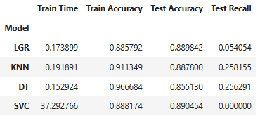

# Practical Application 3-17.1 - Comparing Classifiers #
* Work done for the complete analysis including statistics, observations, and visualizations available in:

    [Jupiter Notebook used](https://github.com/ndhomse/compare-classifiers/blob/main/notebook/Practical_App_3_17.1.ipynb)
### Problem statement ###
The goal is to compare the performance of the classifiers (k-nearest neighbors, logistic regression, decision trees, and support vector machines). 
The classification goal is to predict if the client subscribes (yes) for the product (bank term deposit) or not (no).

### Input data ###
For this purpose, we used a dataset related to the marketing of bank products over the telephone. It comes from the [UCI Machine Learning repository](https://archive.ics.uci.edu/ml/datasets/bank+marketing). The data is from a Portuguese banking institution and is a collection of the results of multiple marketing campaigns. It contains 19 features related to the client (age, education, job, etc.), the campaign (type of contact, day of week, month, duration of call, etc.) and some economic indicators (consumer price index, consumer confidence index, etc.) and 1 target variable indicating if client subscribed to the offered product or not.

#### Findings ####
* The data is very imbalanced - the subscribed proportion is about 11%
* The age group varied from 17 to 98 with a median of 38
* Almost half of the clients work in admin or blue collar jobs, the admin job holders tend to have almost double acceptance rate (13%) than the blue collar ones (6.9%)
* Among the job groups, students (31%) and retired (25%) have the highest subscription rates
* Having housing or personal loans do not seem to have any relevant impact on subscription rates
* Cellular contact seems to have produced higher acceptance rate (15%) than telephone (5%) - may be worth exploring this further from business pov to understand the reasoning behind this finding
* Proportion of subscribed is higher in the months of Mar, Sep, Oct, Dec - which suggests perhaps increasing the contacts in those months could be beneficial. However, the data (number of contacts) in those months is also signficantly lower. So, not conclusive, but perhaps enough to give it a test in future campaigns
* Seeing some strong positive correlation between these variables: 'emp.var.rate', 'cons.price.idx', 'cons.conf.idx', 'euribor3m', 'nr.employed'
* 'emp.var.rate' has strong positive correlation with 'cons.price.idx', 'euribor3m', 'nr.employed' - Need to understand the business implications better
* For this use case, the Recall score was picked as the evaluation metric -- we want to maximise detection of potential subscribers
* Best model findings:
  * KNN model seems to have benefited the most with hyperparameter tuning, coming up with the best test recall score.
  * DecisionTree came up very close to the best recall score. It also has the shortest fit time of all models.
  * SVM comes up next best, but at a very high compute cost.
  * Recommend using the DecisionTree model for this use case
  
  

#### Next Steps and Recommendations ####
* Recommend using the DecisionTree model for predictions for this use case
* Seeing strong positive correlation between these variables: 'emp.var.rate', 'cons.price.idx', 'cons.conf.idx', 'euribor3m', 'nr.employed'. It would be useful to work with the business folks to understand the implications of these variables to further fine tune the model
* Business could benefit targeting admin, students and retired clients for these campaigns
* May be worth exploring why the cellular contact has produced thrice the acceptance rate than telephone contacts and target the future campaigns accordingly
* Should consider future campaigns focusing more on the Mar, Sep, Oct and Dec months
